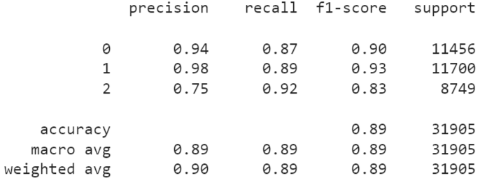
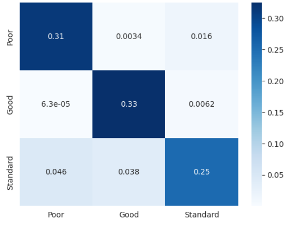
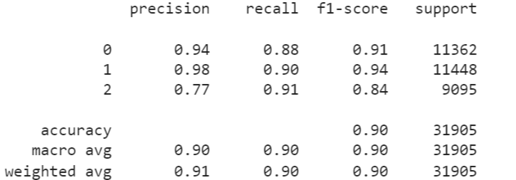
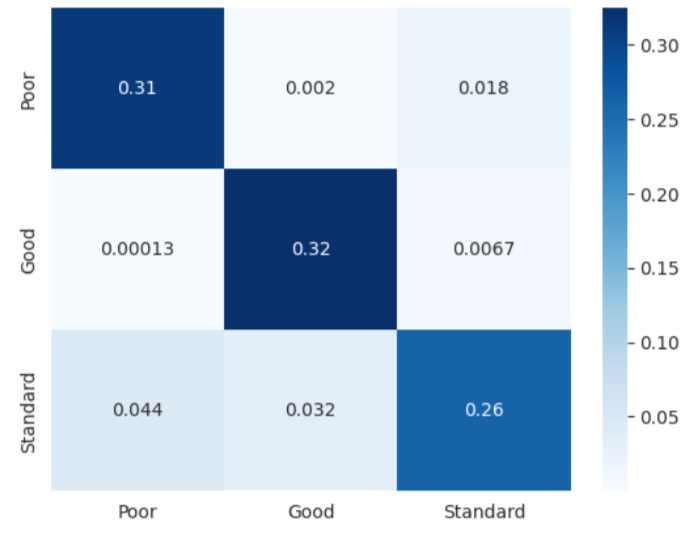

# Find My Credit

#### End-to-end credit score classification model project

## About this Project
  
### Description/Motivation
This project focuses on building a classification model to predict credit scores (Poor, Standard, Good) based on an individual's credit-related financial information, such as income, outstanding debt, and payment behavior. Predicting credit scores accurately can assist financial institutions in making informed lending decisions and manage risk. The motivation behind this project was to apply machine learning techniques to financial data and showcase data cleaning, EDA, feature engineering, and model-building using Random Forest and XGBoost.

### Modeling Process
The following models were applied in this project:
- **Logistic Regression**: Used as a baseline for binary classification.
- **Random Forest**: Selected for its ability to handle complex data relationships.
- **XGBoost**: Chosen for its high performance with imbalanced datasets.

Oversampling techniques (SMOTE) were used to address class imbalance, and feature scaling was applied using StandardScaler.

### Results
Achieved an accurcy of 89% for both Random Forest and XGBoost models.

**Random Forest:** 
- Classifcation Report


- Confusion Matrix


**XGBoost:**
- Classifcation Report


- Confusion Matrix


Through feature selection techniques, discovered that **outstanding debt** is the most significant feature to predict the outcome.


<!-- ROADMAP -->

## Roadmap
- [X] Data Cleaning
  - [X]  Cleaned numerical data by replacing missing values, removing negative values, outliers, and random characters
  - [X]  Cleaned categorical data by removing random characters and one-hot-encoded everything
- [X] Exploratory Data Analysis (EDA)
- [X] Feature Engineering
- [X] Statistical Modeling with Multicollinearity checks using Variance Inflation Factor (VIF)
- [X] Data Preprocessing
  - [X]  Reconstructed cleaned dataset, handled class imbalance, and split data into training and testing sets
- [X] Model and Evaluation
- [ ] Hyperparameter Tuning for Model Optimization 
- [ ] Additional Feature Engineering

## Contributing
### Installation
1. Clone the repository:
   ```sh
   git clone https://github.com/nmhumbe/CreditScoreClassification
   ```
2. Create a virtual environment and activate it:
   ```sh
   python -m venv env
   source env/bin/activate
   ```
3. Install the dependencies:
   ```sh
   pip install pandas numpy seaborn matplotlib statsmodels scikit-learn imbalanced-learn 
   ```
   
### Guidelines
Contributions are **welcome!** Feel free to fork the repository and submit a pull request. If you find any issues or have ideas for improvements, please open an issue with the tag "enhancement."

1. Fork the Project
2. Create your Feature Branch (`git checkout -b feature/AmazingFeature`)
3. Commit your Changes (`git commit -m 'Add some AmazingFeature'`)
4. Push to the Branch (`git push origin feature/AmazingFeature`)
5. Open a Pull Request
   

<!-- LICENSE -->
## License
Distributed under the MIT License. See `LICENSE.txt` for more information.

<!-- CONTACT -->
## Contact

Neha Humbe - nehahumbe@ucla.edu

Project Link -  https://github.com/nmhumbe/CreditScoreClassification


<!-- ACKNOWLEDGMENTS -->
## Acknowledgments
* [Kaggle Dataset](https://www.kaggle.com/datasets/parisrohan/credit-score-classification)
* [README Template](https://github.com/othneildrew/Best-README-Template)
   
